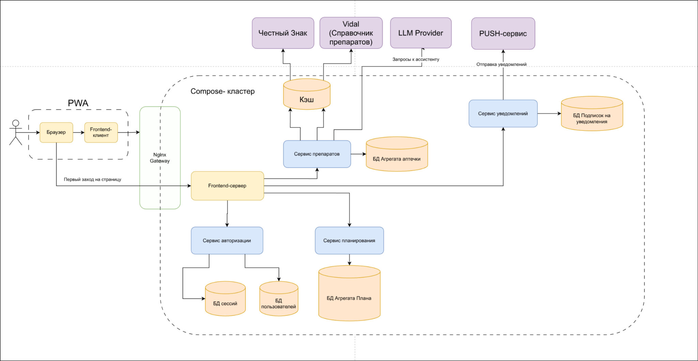

# 💊 Бекенд-репозиторий выпускного проекта команды FSO

<p align="center">
  
  
  
  
  
</p>

Бэкенд часть PWA-приложения **«Умная аптечка»**, разработанного в рамках выпускного проекта образовательной программы **VK Education в МГТУ им. Н.Э. Баумана**.

Фронтенд репозиторий: [FSO-VK/final-project-vk-frontend](https://github.com/FSO-VK/final-project-vk-frontend)

## 📌 О проекте

«Умная аптечка» - это сервис, призванный упростить контроль за домашними лекарствами. Приложение позволяет вести учет препаратов (сроки годности, остатки, инструкции), а также планировать расписание приема лекарств с получением PUSH-уведомлений.

**Главная фича проекта:** Автоматизация рутинного ввода данных. Приложение умеет обрабатывать отсканированные DataMatrix коды с упаковок, получая данные о лекарстве через государственную систему «Честный ЗНАК» и справочник Vidal. А встроенный LLM-ассистент помогает быстро найти нужную информацию в инструкции к препарату.

## ⚙️ Архитектура

Проект спроектирован с использованием **микросервисной архитектуры**, принципов **Clean Architecture** и элементов **Domain-Driven Design (DDD)**. Взаимодействие между микросервисами осуществляется по **REST API**.

<p align="center">
  
</p>

### Основные компоненты:
* **Nginx Gateway** - единая точка входа, балансировка и маршрутизация запросов к сервисам.
* **Сервис авторизации** — управление пользователями и сессиями.
* **Сервис препаратов** - CRUD операции с аптечкой пользователя, бизнес-логика обработки сканов DataMatrix.
* **Сервис планирования** - логика составления расписания приема лекарств.
* **PUSH-сервис (Уведомления)** - реализован на базе фоновых воркеров, которые регулярно опрашивают базу данных расписания и асинхронно отправляют уведомления клиентам через Web Push API.

### 💾 Работа с данными (Storage Layer)
На этапе MVP для хранения основного массива данных используется In-memory хранилище, а для кэширования ответов внешних систем (чтобы снизить сетевые задержки при обращении к Vidal) применяется **MongoDB**. 
Слой работы с данными строго изолирован с помощью **паттерна Repository**. Это позволяет легко подменить реализацию хранилища и безболезненно мигрировать на реляционную БД (например, PostgreSQL) без изменения бизнес-логики сервисов.

## 🛠 Стек технологий

* **Язык программирования:** Go (Golang)
* **Архитектура:** Microservices, Clean Architecture, DDD, REST API
* **Хранилища данных:** In-memory, MongoDB (для кэширования)
* **Инфраструктура:** Docker, Docker Compose, Nginx
* **CI/CD:** GitHub Actions (автоматический деплой)

## 🔌 Внешние интеграции

Бэкенд активно взаимодействует со сторонними API:
1. **«Честный ЗНАК»:** Получение серии, количества таблеток в упаковке, сроков годности и типа лекарства по DataMatrix коду.
2. **Vidal.ru:** Получение актуальных электронных инструкций к препаратам (интегрирован слой кэширования в MongoDB).
3. **GigaChat API (Sber):** LLM-ассистент. Анализирует текст инструкции и отвечает на вопросы пользователя (например, "Принимать до или после еды?"), строго ограничиваясь контекстом инструкции.
4. **Web Push API:** Механизм доставки уведомлений о приеме лекарств в браузер пользователя.

## 🚀 Запуск проекта локально

1. Склонировать репозиторий

2.  Создать .env файл в корне проекта на основе .env.example и заполните ключи (для GigaChat, настроек окружения и т.д.).

3. Собрать и запустить docker контейнеры

```
docker compose -f compose.dev.yml up --build
```

## 👨‍💻 Команда разработки

- [Илья Андриянов](https://github.com/Regikon) - Team Lead, Fullstack (TS + Go)

- [Михаил Черепнин](https://github.com/Ifelsik) - Fullstack (Go + TS), UI/UX дизайн

- [Олег Музалев](https://github.com/Olgmuzalev13) - Backend, DevOps

## Инструменты, которые следует установить

1. [golangci-lint](https://github.com/golangci/golangci-lint) - линтеры

2. [gotestsum](https://github.com/gotestyourself/gotestsum) - форматированный вывод информации о тестах

## Команды

Команда для установки зависимостей.

```make setup```

Локальный запуск (для разработки) c
отслеживанием изменений в файлах и пересборкой контейнеров.

```make dev```

Форматирование кода

```make format```

Запуск линтеров

```make lint```

Тесты

```make test```